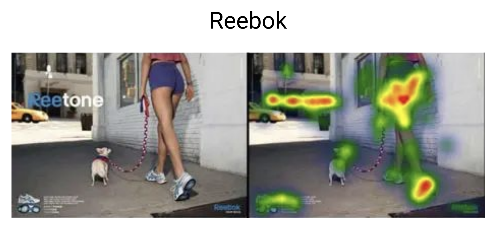
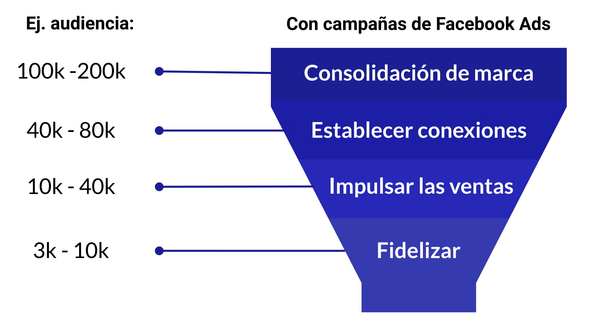
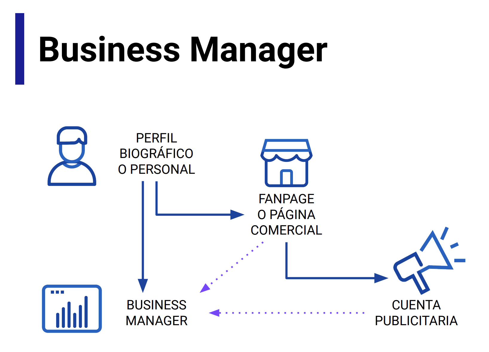
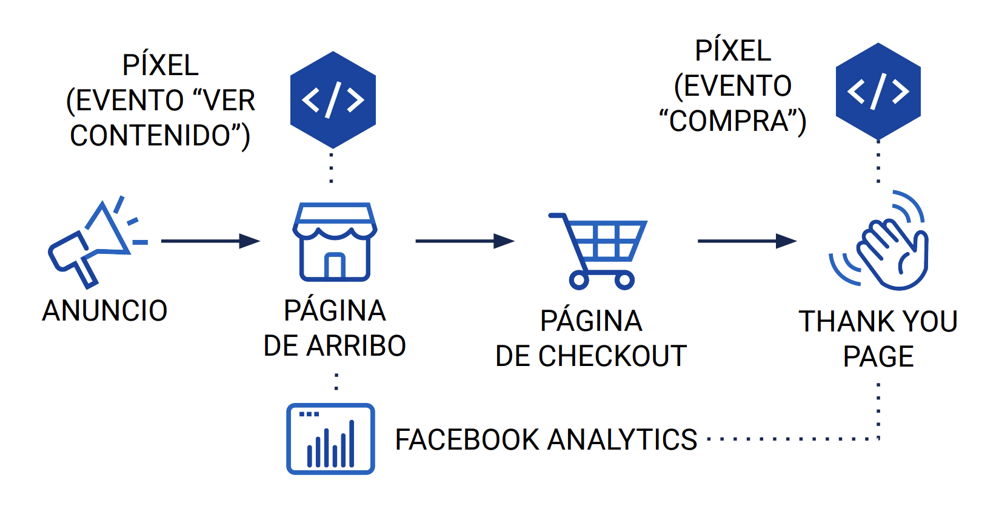
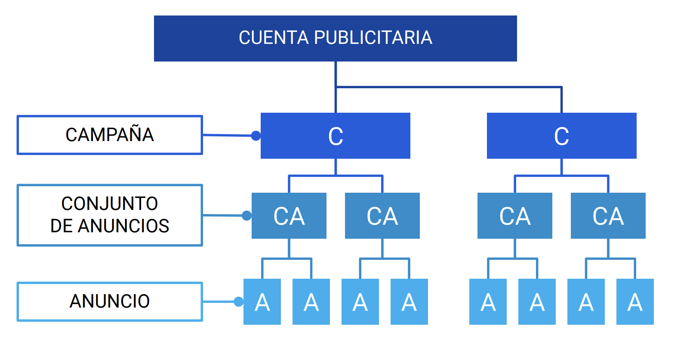
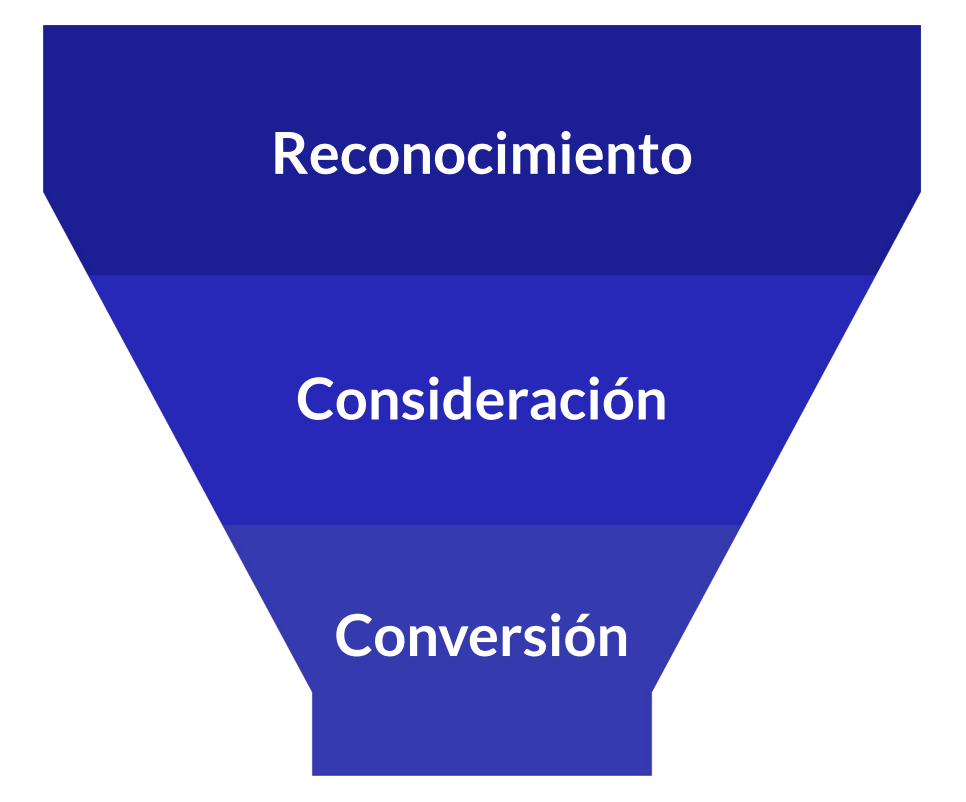

# Curso de Meta Ads Básico

## Introducción a Meta Ads

### Guía del Curso

* Algortimo de Facebook/Instagram
* Túneles de Venta e Inversión
* Creación de cuenta de business manager
* Creación de públicos
* Píxel
* Creación de cuenta publicitaria
* Estructura de campañas
* Clásicos "fails" en campañas
* Análisis y Optimización
* Herramientas varias
* Retos

### Algoritmos en Facebook e Instagram

Un algoritmo es un conjunto de operaciones que se llevan a cabo para realizar un cálculo o resolver un problema. En el caso de Facebook e Instagram, el algoritmo es el conjunto de operaciones que se llevan a cabo para mostrar el contenido a los usuarios.

¿Cómo predice lo que nos interesa?

* Qué miramos
* Qué buscamos
* Tiempo mirando una publicación
* Gustos
* Clicks
* Publicaciones

¿Qué otros aspectos?

* Aspecto demográfico y psicográfico
* Orientación política, religiosa
* Comportamientos competitivo/colaborativo y de compra

### Eyetracking

El `eyetracking` es una técnica que permite medir la actividad ocular de una persona. Se utiliza para estudiar la atención visual, la percepción y la toma de decisiones.

> Estudio de Facebook: "Mobile and TV: Between the Screens"



## Planifica y Arma tu Estrategia

### Túneles de Venta

¿Qué es un túnel de venta? Es un proceso metodológico que nos permite desarrollar estratégicamente campañas de marketing, publicitarias, etc. para una marca, servicio o producto. Su finalidad es el incremento de cantidad de clientes y la fidelización. 



Etapas de un túnel de venta:

#### Consolidación de marca

* Reconocimiento de marca
* Alcance
* 
  * No se busca vender, sino que la gente conozca la marca
    * Supone que el usuario no conoce la marca
    * Lifestyle, valores de marca.

#### Establecer conexiones

Que los usuarios empiecen a interactuar con la marca. Se busca que el usuario se interese por la marca, pero no se busca vender directamente.

* Reproducciones de video
* Tráfico
* Interacción
* Mensajes
* Generación de clientes potenciales
* Instalaciones de la aplicación
* 
  * Se muestran algunos productos, en este caso una colección en particular
  * Se entrega algo más de datos de los productos o servicios
  * No existe una llamada a la acción directa en el sentido de "compra ahora"

#### Impulsar las ventas

Motivar a los usuarios a comprar. Se busca que el usuario compre el producto o servicio, a través de un canal de venta.

* Conversiones
* Ventas del Catálogo
* Tráfico en el Negocio (físico)
* 
  * Llamada a la acción
  * Ventajas de comprar en la tienda/marca

#### Fidelizar

Que los usuarios se conviertan en clientes recurrentes. Se busca que el usuario vuelva a comprar el producto o servicio.

* 
  * Volver a llamar la atención del usuario
  * Crosselling
  * Sentido de urgencia
  * Destacar beneficios

### Funnel de Venta, Audiencia y Objetivos de Campaña

#### 1 Definir tu cliente ideal

* Identificar variables sociodemográficas (género, nivel socioeconómico, rango etáreo) y psiográficas (valores, hobbies, uso de tecnología).
* Con esto se construye un "buyer persona". El ser ideal al que se quiere llegar.
* Definir que cosas les interesan, que les gusta, que les disgusta, que les preocupa, que les motiva, que les inspira.

#### 2 Propuesta de Valor

¿Qué ofreces? ¿Por qué deberían comprarte a ti y no a la competencia? ¿Qué beneficios obtienen al comprar tu producto o servicio?

#### 3 Definir Objetivos

SMART: Specific, Measurable, Achievable, Relevant, Time-bound. O en español, Específico, Medible, Alcanzable, Relevante, Temporal.

* Ejemplo
  * "Vender más" no es un objetivo SMART
  * "Incrementar las ventas de la colección X en un 20% en el primer trimestre del año, para los usuarios de Santiago" sí es un objetivo SMART

#### Conclusión

* Definir tu cliente ideal
* Definir tu propuesta de valor
* Definir tus objetivos SMART

### Inversión Publicitaria

¿Cuánto invertir en publicidad? Lo primero es que la empresa tenga claro el presupuesto que tiene disponible para invertir en ventas.

* Métrica clave: CPC Medio (Costo por Clic Medio) por país.

¿Qué variables afectan el CPC Medio?

* Puja
* Competencia
* Público objetivo
* Calidad del anuncio
  * A mejor calidad del anuncio, menor CPC
* Factores estacionales
  * E.g.: Heladería en verano
* Impuestos locales
* Ubicaciones de anuncios
  * No es lo mismo, en términos de costo, un anuncio en Instagram que uno en Facebook

En síntesis, no hay una fórmula mágica para determinar cuánto invertir en publicidad. Depende de muchos factores.

Debe ser un presupuesto que pueda afrontar la marca, por un período recomendado de un mes, para poder medir resultados.

### Creación de Cuenta de Business Manager

Herramienta gratuita de Meta que permite gestionar y administrar todos los recursos de la empresa en Facebook e Instagram.



El primer paso es crear un perfil personal en Meta. Luego, se crea un Business Manager y se vincula a la cuenta personal. U otro modo se crea una página comercial y se vincula a la cuenta personal. Luego, se crea una cuenta publicitaria y se vincula a la página comercial.

Es muy importante activar la autenticación de dos factores en la cuenta de Business Manager o Personal. Esto es una medida de seguridad, que evita que personas no autorizadas accedan a la cuenta.

#### Activos comeciales

* Páginas de facebook
* Cuenta de instagram
* Catálogos de productos
* Pixel de conversión
* Cuenta publicitaria
* Etc.

#### Roles y permisos

Distintos roles y permisos para distintas personas. Por ejemplo, un administrador puede hacer todo, un editor puede editar (dah'), un analista puede ver los datos, etc.

#### Consejos

* Planificar
* Crear
* Medir

### Creación de Públicos Guardados, Similares y Personalizados

Puedes crear públicos para tus anuncios en Facebook e Instagram. Estos públicos pueden ser guardados, similares o personalizados.

Se segmentan por:

* Ubicación
  * Ubicaciones definidas
  * Puntos en el mapa y cierto radio
* Edad
* Género
* Idiomas
  * Solo completar si las personas que están en la ubicación hablan un idioma distinto al del país.
* Segmentación detallada
  * Datos demográficos
    * Nivel de educación
    * Mes de cumpleaños
    * Etc.
  * Intereses
    * Comida y bebida
    * Deportes
    * Etc.
  * Comportamientos
    * Actividades de compra
    * Dispositivos
    * Etc.

La segmentación detallada puede utilizarse como un filtro para llegar a un público más específico, por ejemplo, seleccionando varios intereses.

#### Nomenclatura

Es importante tener una nomenclatura clara para los públicos, para poder identificarlos rápidamente. Por ejemplo,

```
[Lugar] [Edad] [Hombres/Mujeres] [Intereses]
```

Así un público de mujeres de 25 a 35 años en Santiago, interesadas en deportes, se podría llamar:

```
Stgo 25-35 M Deportes
```

#### Público Similar

Un público similar es un grupo de personas que comparten características con un público existente. Puede ampliarse o reducirse el tamaño del público similar, según se necesite.

#### Público Personalizado

Audiencias que se crean a partir de una lista de clientes, visitantes del sitio web, interacciones con la aplicación, etc. 

El parámetro retención de días, permite definir cuántos días se consideran para la creación del público.

E.g. `Interacción Instagram 180 días`

### Para qué te sirve la biblioteca de anuncios

En la biblioteca de anuncios puedes ver todos los anuncios que están activos en Facebook e Instagram. Puedes ver los anuncios de la competencia, ver qué tipo de anuncios son tendencia, etc.

Puede segmentarse por país, palabras clave y segmentar por filtros.

Puedes obtener ideas de recursos gráficos, textos, llamadas a la acción, etc.

## El Pixel

### ¿Qué es el Pixel de Facebook?	

Es una herramienta gratuita que permite medir la eficacia de las campañas publicitarias, que se instala en el sitio web.

Se utiliza para campañas de remarketing, para medir conversiones, para entender resultados de campañas, etc.

El pixel permite medir diferentes eventos, como:

* Compras
* Agregar al carrito
* Iniciar sesión
* Ver contenido
* Registrarse
* Etc.



#### Creación del pixel

En la sección 'Orígenes de Datos' de Business Manager, se crear un nuevo pixel y configurar parámetros adicionales.

Existen opciones para agregar el pixel. Una opción es con socio comercial (Shopify, WooCommerce, etc.) y otra es con código manual. También puedes enviar un correo con las instrucciones a un desarrollador.

Asimismo, se puede probar enviando un tráfico de prueba para verificar que el pixel está funcionando correctamente.

### Vinculación del Pixel

El pixel se puede vincular con eventos estándar o predefinidas (compras, agregar al carrito, etc.) o eventos personalizados.

Estándar:

* Agregar al carrito
* Completa el registro
* Comprar
* Ver Contenido
* Buscar

Para editar eventos se abre el administrador de eventos y se selecciona el pixel. Luego, se selecciona el evento que se quiere editar y se selecciona el botón de editar.

[Especificaciones de los eventos estándar del píxel de Meta](https://www.facebook.com/business/help/402791146561655?id=1205376682832142)

#### Pixel Helper

Es una extensión de Chrome que permite verificar si el pixel está instalado correctamente en el sitio web.

## Creación de Campañas

### Creación y Configuración de Cuenta Publicitaria

Antes de empezar a crear campañas debemos configurar la cuenta publicitaria. Para ello, se debe ir a la sección de configuración de la cuenta publicitaria y completar los datos solicitados.

Nombre de la cuenta, zona horaria y moneda son los datos básicos que se deben completar.

Desde aquí se agregan las opciones de pago, se pueden agregar distintos métodos de pago, como tarjetas de crédito, débito, PayPal, etc. Estos tambien se pueden acceder desde el menú de configuración.

### Estructura de Campañas



Dentro de una cuenta publicitaria, se pueden crear distintas campañas. Cada campaña puede tener distintos conjuntos de anuncios y cada conjunto de anuncios puede tener distintos anuncios.

¿Qué diferencia a cada campaña? El objetivo. Cada campaña tiene un objetivo distinto.

¿Qué diferencia a cada conjunto de anuncios? La segmentación. Cada conjunto de anuncios tiene una segmentación distinta.

¿Qué diferencia a cada anuncio? El contenido. Cada anuncio tiene un contenido distinto. Se recomienda trabajar con distintos formatos de anuncios (carrusel, video, imagen, etc.).

### ¿Qué campaña elegir?



Los tipos de campaña se dividen en tres categorías:

1. Reconocimiento
2. Consideración
3. Conversión

Y se asemejan a las etapas de un túnel de venta.

#### Reconocimiento

* Reconocimiento de marca
  
Muestra el anuncio a personas con más probabilidad de recordar o notar tu anuncio. La idea es que las personas descubran tu marca.

* Alcance

Muestra el anuncio a la mayor cantidad de usuarios sin repetirse o minimizando la repetición.

#### Consideración

* Tráfico

Objetivo de llevar tráfico a un sitio web, aplicación, mensajes, etc.

* Interacción

En caso de tener alguna publicación en la página, se puede promocionar para que tenga más interacciones. Reacciones, comentarios, compartir, etc.

* Reproducciones de video

Objetivo de mostrar un video a la mayor cantidad de personas posible.

* Instalaciones de la aplicación

Promocionar la instalación de una aplicación para dispositivos móviles.

* Mensajes

Busca el inicio de una conversación con los usuarios 1 a 1.

* Generación de clientes potenciales

Recopilar datos sensibles o de valor para la empresa.

#### Conversión

* Conversiones

Conseguir que las personas realicen acciones valiosas, como comprar, reservar, registrarse, etc.

* Ventas del catálogo

Mostrar productos de un catálogo a personas que han mostrado interés en ellos.

* Tráfico en el negocio

Promocionar un negocio físico para llevar tráfico a él. En este caso, es muy importante la segmentación geográfica.

### Creación de Campaña

## Creación de Grupos de Anuncios

## Creación de Anuncios

## Análisis y Optimización

## Herramientas Varias
